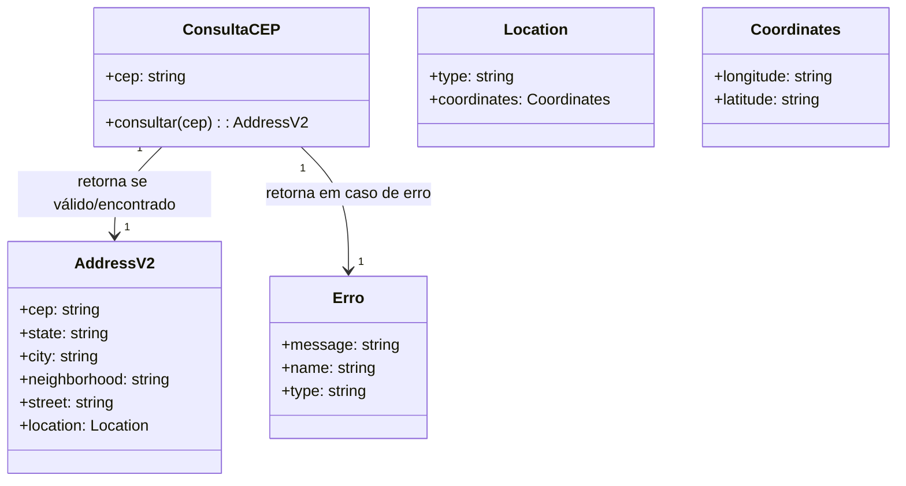

Segue a modelagem do domínio para o endpoint **/cep/v2/{cep}**, considerando **Particionamento de Equivalência** e **Teste de Sintaxe**:

---

## 1. **Identificação do Domínio**

- **Recurso:** Consulta de endereço e geolocalização a partir de um CEP brasileiro.
- **Entrada:** CEP (parâmetro de path).
- **Saída:** Objeto de endereço com geolocalização (`AddressV2`) ou mensagem de erro.

---

## 2. **Partições Relevantes (Particionamento de Equivalência)**

### **Entrada: CEP**

- **Partição Válida:**
  - CEP com exatamente 8 dígitos, podendo estar formatado ou não:
    - Exemplo sem formatação: `12345678`
    - Exemplo com formatação: `12345-678`
- **Partições Inválidas:**
  - CEP com menos de 8 dígitos (ex: `1234567`, `1234-567`)
  - CEP com mais de 8 dígitos (ex: `123456789`, `12345-6789`)
  - CEP com caracteres não numéricos (ex: `12A45-678`, `12.345-678`)
  - CEP vazio ou nulo

### **Saída**

- **Partição Válida:** Objeto `AddressV2`:
  - `cep`: string
  - `state`: string
  - `city`: string
  - `neighborhood`: string|null
  - `street`: string|null
  - `location`: objeto com latitude/longitude
- **Partição Inválida:** Mensagem de erro:
  - CEP inválido ou mal formatado.
  - CEP não encontrado.
  - Erro interno.

---

## 3. **Teste de Sintaxe**

### **Expressão Regular Aceita**

```regex
^[0-9]{8}$|^[0-9]{5}-[0-9]{3}$
```

- Aceita: `12345678`, `12345-678`
- Não aceita: `1234-567`, `12A45-678`, `123456789`, `12345_678`

### **Casos de Teste Derivados**

| Caso | Valor de CEP | Sintaxe Válida? | Esperado | Observação            |
| ---- | ------------ | --------------- | -------- | --------------------- |
| 1    | 12345678     | Sim             | Sucesso  | Sem formatação        |
| 2    | 12345-678    | Sim             | Sucesso  | Com formatação        |
| 3    | 1234-567     | Não             | Erro     | Menos dígitos         |
| 4    | 1234567      | Não             | Erro     | Menos dígitos         |
| 5    | 123456789    | Não             | Erro     | Mais dígitos          |
| 6    | 12A45-678    | Não             | Erro     | Caracter não numérico |
| 7    | ""           | Não             | Erro     | Vazio                 |
| 8    | null         | Não             | Erro     | Nulo                  |

---

## 4. **Restrições**

- O parâmetro `cep` deve conter exatamente 8 dígitos, podendo ter ou não o hífen.
- Não são aceitos caracteres não numéricos, espaços, letras ou outros símbolos.
- Qualquer valor fora desse padrão resulta em erro de sintaxe.

---

## 5. **Interações e Decisões**

- Se o CEP for válido e existir, retorna o endereço completo e geolocalização.
- Se o CEP for válido mas não existir, retorna erro `"CEP não encontrado em nenhum provedor."`.
- Se o CEP for inválido (sintaxe), retorna erro `"CEP deve conter exatamente 8 dígitos"`.
- Se ocorrer erro interno, retorna erro genérico.

---

## 6. **Modelo Conceitual Simplificado**



---

## 7. **Resumo das Decisões**

- O domínio é particionado pelo valor do parâmetro `cep` (válido/inválido).
- A sintaxe é rigorosamente validada por regex.
- A resposta é sempre um endereço completo ou uma mensagem de erro padronizada.
- Não há dependência de outros parâmetros.

---

Se precisar de exemplos de payloads válidos/inválidos ou detalhamento dos objetos de resposta/erro, posso complementar!
