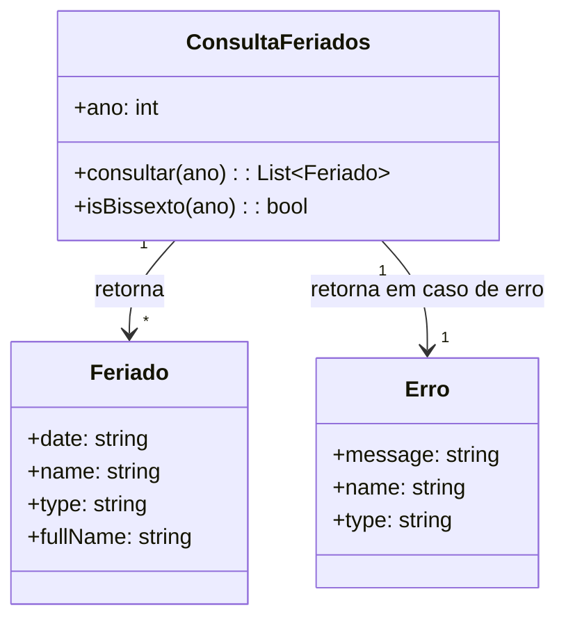

Ótima observação! Segue a modelagem do domínio para o endpoint **/feriados/v1/{ano}**, agora incluindo a **variação para anos bissextos**:

---

## 1. **Identificação do Domínio**

- **Recurso:** Consulta de feriados nacionais brasileiros para um determinado ano.
- **Entrada:** Ano (parâmetro de path).
- **Saída:** Lista de feriados (`Holiday[]`) ou mensagem de erro.

---

## 2. **Partições Relevantes (Particionamento de Equivalência)**

### **Entrada: Ano**

- **Partição Válida:**
  - Anos inteiros no intervalo **[1900, 2199]** (inclusive).
    - **Subpartição:** Ano bissexto (ex: 1904, 2000, 2024, 2196).
    - **Subpartição:** Ano não bissexto (ex: 1901, 2023, 2199).
- **Partições Inválidas:**
  - Anos menores que 1900.
  - Anos maiores que 2199.
  - Valores não inteiros (ex: "2023.5", "abcd").
  - Valores nulos ou ausentes.

### **Saída**

- **Partição Válida:** Lista de feriados (`Holiday[]`), cada um com:
  - `date`: string (YYYY-MM-DD)
  - `name`: string
  - `type`: string (ex: "national")
- **Partição Inválida:** Mensagem de erro:
  - Ano fora do intervalo suportado.
  - Erro interno.

---

## 3. **Análise de Valor Limite e Variação Bissexto**

### **Limites Inferiores e Superiores**

- **Limite Inferior Aceito:** 1900
- **Limite Superior Aceito:** 2199
- **Fora dos Limites:** 1899, 2200

### **Casos de Teste Derivados**

| Caso | Valor de Ano | Bissexto? | Esperado | Observação                 |
| ---- | ------------ | --------- | -------- | -------------------------- |
| 1    | 1900         | Não       | Sucesso  | Limite inferior            |
| 2    | 1904         | Sim       | Sucesso  | Limite inferior + bissexto |
| 3    | 2000         | Sim       | Sucesso  | Ano bissexto típico        |
| 4    | 2023         | Não       | Sucesso  | Valor típico não bissexto  |
| 5    | 2024         | Sim       | Sucesso  | Valor típico bissexto      |
| 6    | 2196         | Sim       | Sucesso  | Limite superior - bissexto |
| 7    | 2199         | Não       | Sucesso  | Limite superior            |
| 8    | 1899         | -         | Erro     | Limite inferior -1         |
| 9    | 2200         | -         | Erro     | Limite superior +1         |
| 10   | "abcd"       | -         | Erro     | Valor não numérico         |
| 11   | null         | -         | Erro     | Valor ausente/nulo         |

### **Variação no Resultado para Bissexto**

- Em anos bissextos, o mês de fevereiro tem 29 dias.
- Feriados móveis (como Carnaval, Páscoa, Corpus Christi) podem cair em datas diferentes em anos bissextos devido ao cálculo da Páscoa.
- Feriados fixos não mudam (ex: "2024-01-01" sempre existe).

---

## 4. **Restrições**

- O parâmetro `ano` deve ser inteiro, entre 1900 e 2199.
- O cálculo dos feriados móveis deve considerar corretamente se o ano é bissexto.
- Qualquer valor fora desse intervalo ou não inteiro resulta em erro.

---

## 5. **Interações e Decisões**

- Se o ano for válido, retorna lista de feriados calculados (fixos e móveis), considerando corretamente o ano bissexto.
- Se o ano for inválido, retorna erro com mensagem `"Ano fora do intervalo suportado entre 1900 e 2199."`.
- Se ocorrer erro interno, retorna erro genérico.

---

## 6. **Modelo Conceitual Simplificado**



---

## 7. **Resumo das Decisões**

- O domínio é particionado pelo valor do parâmetro `ano` e pela característica de ser ou não bissexto.
- Os limites são estritamente validados.
- A resposta é sempre uma lista de feriados ou uma mensagem de erro padronizada.
- O cálculo dos feriados móveis depende do ano ser bissexto ou não.

---

## Exemplo de Lógica para Detecção de Ano Bissexto

```python
def is_bissexto(ano):
    return (ano % 4 == 0 and ano % 100 != 0) or (ano % 400 == 0)
```

---

Se precisar de exemplos de payloads para anos bissextos e não bissextos, ou detalhamento dos cálculos dos feriados móveis, posso complementar!
