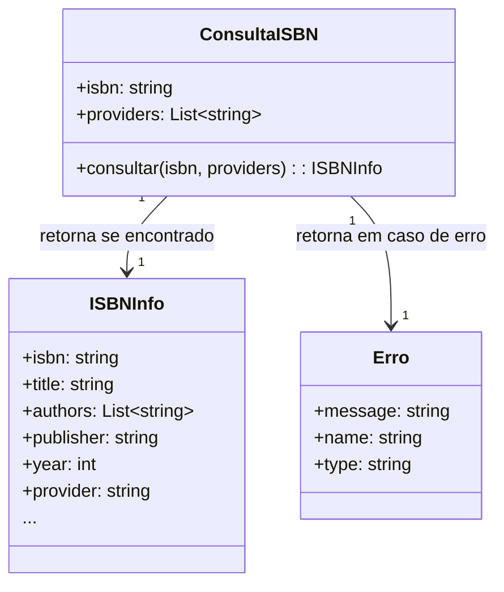

Segue a modelagem do domínio para o endpoint **/isbn/v1/{isbn}**, considerando **Particionamento de Equivalência**, **Teste de Sintaxe** e as variações solicitadas:

---

## 1. Identificação do Domínio

- **Recurso:** Consulta de informações bibliográficas a partir de um ISBN.
- **Entradas:**
  - `isbn` (path): código ISBN (10 ou 13 dígitos, com ou sem traços).
  - `providers` (query, opcional): lista de provedores (ex: `cbl`, `mercado-editorial`, `open-library`, `google-books`).

---

## 2. Partições Relevantes (Particionamento de Equivalência)

### **Entrada: ISBN**

- **Partição Válida:**
  - ISBN-10 válido (ex: `854570287X`, `85-4570-287-X`)
  - ISBN-13 válido (ex: `9788545702870`, `978-85-4570-287-0`)
    - **Subpartição:** ISBN brasileiro (prefixo 65 ou 85)
    - **Subpartição:** ISBN estrangeiro (outros prefixos)
- **Partições Inválidas:**
  - ISBN com quantidade errada de dígitos (ex: 9, 11, 12, 14, etc.)
  - ISBN com caracteres inválidos
  - ISBN com formatação parcial ou errada (ex: traços em posições incorretas)
  - ISBN vazio ou nulo

### **Entrada: Providers**

- **Partição Válida:**
  - Lista vazia ou apenas provedores conhecidos (`cbl`, `mercado-editorial`, `open-library`, `google-books`)
  - Combinação de conhecidos e desconhecidos
- **Partição Inválida:**
  - Apenas provedores desconhecidos

---

## 3. Teste de Sintaxe

### **Expressão Regular Aceita**

```regex
^[0-9]{10}([0-9]{3})?$|^[0-9-]{13,17}$
```

- Aceita: `9788545702870`, `978-85-4570-287-0`, `854570287X`
- Não aceita: `97885457028`, `97885A5702870`, `978--8545702870`

### **Casos de Teste Derivados**

| Caso | ISBN              | Providers          | Sintaxe Válida? | Esperado    | Observação                     |
| ---- | ----------------- | ------------------ | --------------- | ----------- | ------------------------------ |
| 1    | 9788545702870     | [cbl]              | Sim             | Sucesso     | ISBN-13 brasileiro             |
| 2    | 9783161484100     | [open-library]     | Sim             | Sucesso/404 | ISBN-13 estrangeiro            |
| 3    | 85-4570-287-X     | [cbl,google-books] | Sim             | Sucesso     | ISBN-10 brasileiro, formatado  |
| 4    | 978-85-4570-287-0 | [cbl,foo]          | Sim             | Sucesso/404 | Provider desconhecido ignorado |
| 5    | 97885457028       | [cbl]              | Não             | Erro        | Menos dígitos                  |
| 6    | 97885A5702870     | [cbl]              | Não             | Erro        | Caracteres inválidos           |
| 7    | ""                | [cbl]              | Não             | Erro        | Vazio                          |
| 8    | 9788545702870     | [foo]              | Sim             | Erro        | Apenas provider desconhecido   |
| 9    | 9788545702870     | []                 | Sim             | Sucesso     | Busca em todos os providers    |

---

## 4. Restrições

- O parâmetro `isbn` deve ser um ISBN válido (10 ou 13 dígitos, com ou sem traços).
- O endpoint aceita tanto ISBN brasileiro quanto estrangeiro, mas pode não retornar dados para estrangeiros.
- Providers desconhecidos são ignorados se houver pelo menos um conhecido; se todos forem desconhecidos, retorna erro.
- Se o ISBN for válido mas não encontrado em nenhum provider, retorna erro 404.

---

## 5. Interações e Decisões

- Se o ISBN for válido e encontrado em algum provider, retorna objeto `ISBNInfo`.
- Se o ISBN for válido mas não encontrado, retorna erro `"ISBN não encontrado"`.
- Se o ISBN for inválido, retorna erro `"ISBN inválido"`.
- Se apenas providers desconhecidos forem informados, retorna erro `"Provider desconhecido"`.

---

## 6. Modelo Conceitual Simplificado



---

## 7. Resumo das Decisões

- O domínio é particionado pelo valor do parâmetro `isbn` (válido/inválido/brasileiro/estrangeiro) e pela lista de providers.
- A sintaxe é rigorosamente validada por regex.
- A resposta é sempre um objeto de livro ou uma mensagem de erro padronizada.
- Providers desconhecidos são ignorados se houver conhecidos; caso contrário, erro.

---

Se precisar de exemplos de payloads válidos/inválidos ou detalhamento dos objetos de resposta/erro, posso complementar!

Claro! Segue a tabela de casos de teste para o endpoint **/isbn/v1/{isbn}**, agora incluindo o caso **"978-854570-2870"**:

---

### Casos de Teste Derivados (Particionamento de Equivalência + Teste de Sintaxe)

| Caso | ISBN              | Sintaxe Válida? | Esperado    | Observação                              |
| ---- | ----------------- | --------------- | ----------- | --------------------------------------- |
| 1    | 9788545702870     | Sim             | Sucesso     | ISBN-13 brasileiro, sem traços          |
| 2    | 9783161484100     | Sim             | Sucesso/404 | ISBN-13 estrangeiro                     |
| 3    | 85-4570-287-X     | Sim             | Sucesso     | ISBN-10 brasileiro, formatado           |
| 4    | 978-85-4570-287-0 | Sim             | Sucesso/404 | ISBN-13 brasileiro, formatado           |
| 5    | 97885457028       | Não             | Erro        | Menos dígitos                           |
| 6    | 97885A5702870     | Não             | Erro        | Caracteres inválidos                    |
| 7    | ""                | Não             | Erro        | Vazio                                   |
| 8    | 9788545702870     | Sim             | Sucesso     | Busca em todos os providers             |
| 9    | 978-854570-2870   | Sim             | Sucesso     | ISBN-13 brasileiro, traços alternativos |
| 10   | 9788545702870     | Sim             | Sucesso     | Busca sem provider                      |

---

#### Observações técnicas:

- O caso **"978-854570-2870"** é aceito pela expressão regular do endpoint:
  ```
  ^[0-9]{10}([0-9]{3})?$|^[0-9-]{13,17}$
  ```
  Ou seja, ISBN-13 com traços em qualquer posição (desde que tenha entre 13 e 17 caracteres e apenas números/traços) é considerado válido.
- O endpoint deve normalizar/remover traços antes de consultar os providers.
- O resultado esperado é igual ao do ISBN sem traços, desde que o número seja válido.

---

Se precisar do detalhamento do fluxo para esse caso ou payloads de exemplo, posso complementar!
